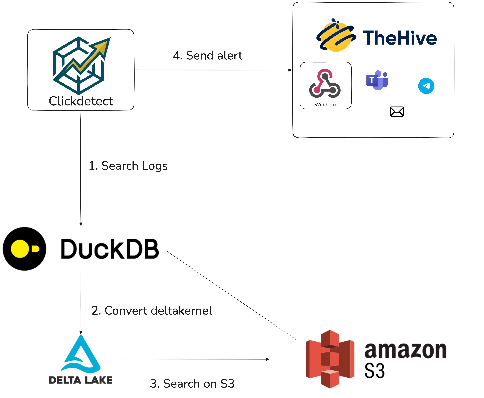

# Advanced security alerting with DuckDB and Delta Lake | Clickdetect



Hey, do you like DuckDB and want to generate security alerts using it? I have a solution for you.

Recently I started studying *Delta Lake* from Databricks, and I started looking for SQL engines to search logs in the *data lake*.

During my study I reached some conclusions: the concept of a data lake is not explored much right now, so I'm here to explain why this is a good option for a SIEM database and how you can generate security alerts with it.

This blog is not meant to teach you how to create a data lake with security data, but you can do this with Wazuh... I did it ;)

So, [Clickdetect](https://github.com/clicksiem/clickdetect) is a tool that I'm developing with many data source integrations, and I recently created the DuckDB data source.

*DuckDB* can integrate with many data sources too, so in this blog post I will show you why and how you can use DuckDB to generate security alerts using *Delta Lake*.

## Why did you mention "Advanced"?

I have some thoughts that make me consider this advanced.

- Have you searched about security analytics with *Delta Lake* and found something about it? Like some free solutions? :/
- If you work with SIEM or with data analytics, you will understand the price of storage...
- Data lake is a recent data model, and big companies are developing their own solutions; right now I don't see anyone talking about security analytics with this.
- Outside of your data engineering bubble, many people don't understand what a data lake is.
- Do I really need to explain more?

## Why DuckDB?

DuckDB is a SQL engine; right now it is not a database. You don't need to deploy or create large servers to use DuckDB.

You can think of DuckDB as a connector for different data sources you have, like PostgreSQL.

Why did I choose DuckDB for this blog post? Because it is lightweight. With Clickdetect you don't need to deploy a large server to run and get security analytics data.

If you want to deploy large servers, you may need to think of another option, like *ClickHouse*. ClickHouse can search large amounts of data in S3 using a cluster, which is the right option for large environments.

## What is Delta Lake?

Delta Lake is a storage framework on steroids. It's not a file format.

Delta Lake was created by Databricks and is governed by the Linux Foundation. You can store terabytes/petabytes in S3 storage and use Delta Lake as the framework to do that.

You can use Delta Lake to store petabytes in S3 storage and still have good search performance.

Delta Lake stores metadata about the files, ensuring file skipping. You can use partitions to store logs in logically separated directories for better performance, and many other things.

## Let's do it

So, let's get hands on. We will deploy Clickdetect with the DuckDB data source and use DuckDB's `delta_scan` function to search on Delta Lake.

### Rule creation

In this example, I will use my local Delta Lake on my disk, but you can use an S3 database too.

First of all, you need to create your rule. Clickdetect rules are simple; if you are familiar with Sigma rules, this will be easy.

First, create your rule directory.

```sh
mkdir rules/
cd rules
```

Create your rule inside the rules/ directory; in this example it will be rule.yml.

As the example for this post, I will use DuckDB's `delta_scan` function. Here I filter on Windows Event ID `4720` (*A user account was created*).

```yaml
id: "3f2b1c4a-9d7e-4a1b-8c2d-5e6f7a8b9c0d"
name: "Windows admin created"
level: 5
size: ">0" # trigger if the query returns more than 0 rows
active: true
author: 
    - Vinicius Morais <me@souzo.me>
rule: |- # this is the rule data
    SELECT * FROM delta_scan("tmp/test") where timestamp >= now() - interval 5 minute and win.data.eventID = '4720'
```

The `size: ">0"` field is what decides when the alert fires: if the query returns more than 0 rows within the interval, the rule triggers. You can use other comparisons (for example `">10"`) to alert only above a threshold.

Now you have your first DuckDB rule!

!!! note
    `delta_scan` requires DuckDB's `delta` extension. DuckDB auto-installs and loads official extensions on first use when it has internet access. If you run in an offline/air-gapped environment, install it beforehand with `INSTALL delta; LOAD delta;`.

### Runner

Now you need to define the runner.

The runner is the main configuration that defines: scheduler, rule path, data source, plugins and webhooks.

Go back to the parent directory and create `runner.yml` outside the rules directory.

```sh
cd ..
```

This is the example runner.yml

```yaml
datasource:
    type: duckdb
    database: ":memory:"

webhooks:
    generic_webhook:
        type: generic
        url: http://localhost:3000/alerts/create/clickdetect
        headers:
          X-Type: test

detectors:
    my_detector_1:
        name: "5m interval"
        for: "5m"
        description: "detect rules with 5 min interval"
        rules:
            - "/app/rules/*.yml"
        webhooks:
            - generic_webhook
        sigma: false

```

### Docker deploy & Run

The easiest way is using Docker; you just need to deploy the latest package.

```sh
docker run -v ./rules/:/app/rules/ -v ./runner.yml:/app/runner.yml -v ./tmp/test/:/app/tmp/test/ -p 8080:8080 ghcr.io/clicksiem/clickdetect:latest --api -p 8080 -r /app/runner.yml
```

The extra volume (`./tmp/test/`) mounts your local Delta Lake into the container so the `delta_scan("tmp/test")` in the rule can reach it. If your data lake lives in S3 instead, drop this volume and point `delta_scan` at your `s3://` path.

With this, you now have a fully functional Clickdetect running your rule.


### Results

This is the result of running the rule with the DuckDB search in the **Delta Lake** repository.

<video controls with="640">
    <source src="/assets/clickdetect-run-duckdb.mp4" type="video/mp4">
</video>

As you can see, Clickdetect can search data using DuckDB, and based on the rule match the rule will trigger and send the alert to the `webhook`.


## Extra

You can use Clickdetect with an **AI agent** to automatically analyze your alerts and generate context.

This is the configuration for `runner.yml`

```yaml
plugins: 
  clickagentic:
    provider: 'deepseek'
    model: 'deepseek-chat'
    token: 'X'
```

This is the result from my last post.


I did the same in my last blog post about OpenSearch PPL.

[OpenSearch PPL post](https://medium.com/bugbountywriteup/extending-wazuh-detection-capabilities-with-clickdetect-opensearch-ppl-and-sigma-rules-3a52e706cac5)

## Conclusion

With this, you can use Clickdetect as the alerting engine for your data lake and DuckDB as the SQL engine for it.

My Social
* **Github**: https://github.com/souzomain
* **E-mail**: safeup@souzo.me
* **Matrix**: @souzo:matrix.org
* **Twitter/X**: https://x.com/souzomain
* **Linkedin**: https://www.linkedin.com/in/vinicius-m-a76ba51b5/
* **Reddit**: https://www.reddit.com/user/_souzo/
