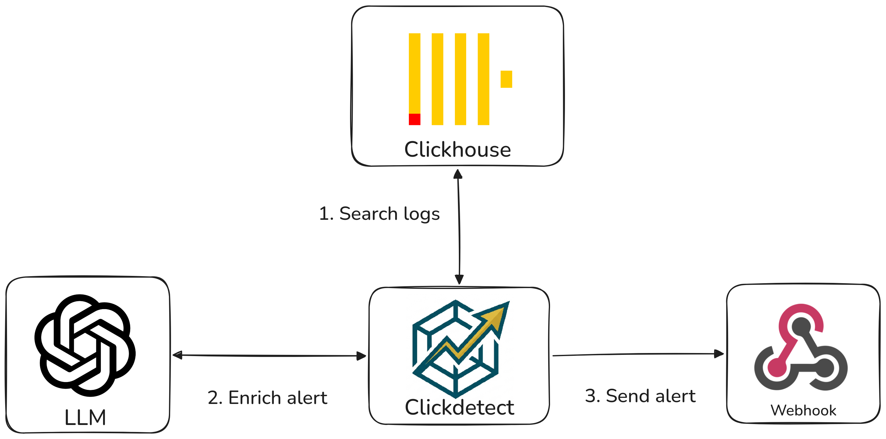
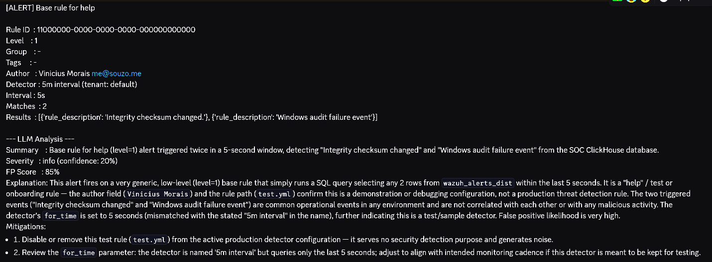

# AI SOC Agent with clickdetect!

Hey guys, souzo here. Today I'm announcing the AI SOC agent for clickdetect.

I've been working on a plugin system for clickdetect for a while. To demonstrate the powerful capabilities of clickdetect, I have implemented the plugin *clickagentic*!

In this blog post I'll walk you through clickagentic to demonstrate the power of clickdetect.

Clickdetect repository: [https://github.com/clicksiem/clickdetect](https://github.com/clicksiem/clickdetect)



## Clickagentic the SOC AI agent

Clickagentic intercepts the generated alert before sending it to a webhook. It receives all content to analyze the alerts and generate an automated response.

#### **Plugin System**

I have implemented a plugin system in clickdetect, and now you can create your own plugin to do whatever you want like:
- Block an IP in the firewall
- Integrate your system without needing a webhook
- Create your own SOC AI agent :)

Check the documentation for a more detailed explanation.
[https://clickdetect.souzo.me/plugin/](https://clickdetect.souzo.me/plugin/)

#### **Agent response**

This is the default response schema of the SOC agent.

summary(str): This is the summary generated by the agent
severity(Enum(Critical, High, Medium, Low)): The agent will generate a severity based on context of the alert
confidence(int): This is the confidence percentage of the generated response
false_positive_score(int): This indicates the percentage chance the alert may be a false positive
explanation(str): Detailed explanation of the alerts
mitigations(List[str]): Mitigation list for the generated alert

#### **Installation**

To use the clickagentic, you need to install the clickagentic packages

```
uv sync --group clickagentic
```

#### **Configuration**

You need to configure the runner to run the clickagentic plugin and your LLM

Add this at the end of your runner.yml

```yaml
plugins:
  clickagentic: # plugin id
    provider: 'openai' # provider: openai, anthropic, google, huggingface, ollama, openrouter, deepseek
    model: 'gpt-5.2' # model name from your provider
    token: 'xxx'
    false_positive: |
        Scanner 10.0.0.5 runs daily vulnerability scans and will trigger
        port-scan rules. Ignore alerts where source_ip is 10.0.0.5.
```

As you can see, you can set up your own false positive considerations.

#### **Running**

You can simply run the clickdetect with the configured runner

```
uv run clickdetect -r runner.yml
```

This is what the agent response looks like



## Considerations

#### **Cost**

Each alert processed by clickagentic triggers a call to your LLM provider, which may incur API costs depending on the provider and model you choose. In high-volume environments, this can add up quickly. Consider filtering low-severity alerts before they reach the plugin to reduce unnecessary calls.

#### **Privacy**

Alert data sent to external LLM APIs (OpenAI, Anthropic, Google, etc.) may contain sensitive information such as IP addresses, usernames, or internal hostnames. If your environment has strict data residency or compliance requirements, consider using a local provider like [Ollama](https://ollama.com) to keep all data on-premise.

```yaml
plugins:
  clickagentic:
    provider: 'ollama'
    model: 'llama3.2'
    token: ''
```

## Known Limitations

#### **Latency and query thresholds**

Calling an LLM introduces latency that can range from a few hundred milliseconds to several seconds depending on the provider and model. If your clickdetect runner is configured with a detection threshold in seconds, the LLM response time may exceed that window and cause issues in the query cycle. It is recommended to use thresholds of at least one minute when running clickagentic, or to use a fast local model via Ollama to reduce response times.

## Conclusion

With clickagentic, the possibilities are endless — automate triage, enrich alerts, and respond faster.
You can automatically skip alerts with a false positive score above 90%.
You can automate your SOC L1 process. Want to validate alerts in other systems? Try using MCP, or open an issue and let me know!


If this project helped you or sounds promising, **please give it a star on GitHub** — it means a lot and helps the project reach more people in the security community.

[⭐ Star Clickdetect on GitHub](https://github.com/clicksiem/clickdetect)

Have questions, ideas, or want to contribute? Open an issue or a pull request — the door is always open.
