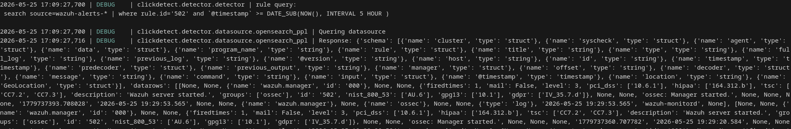
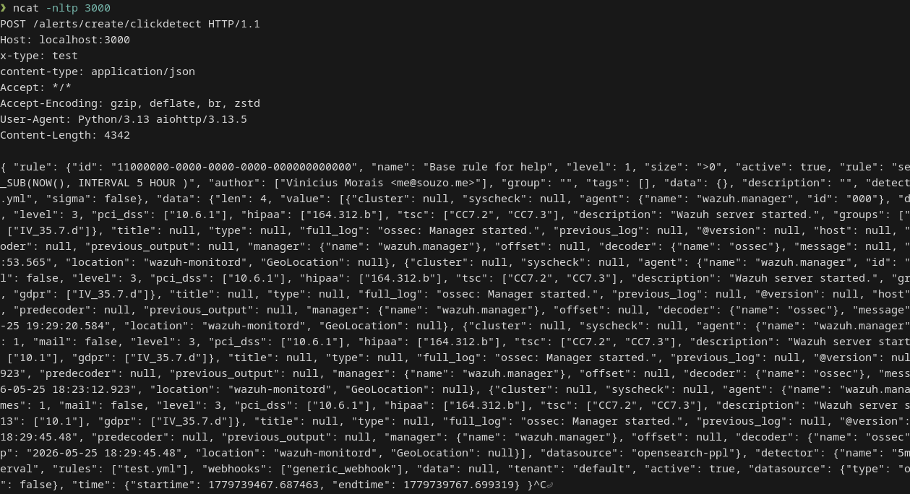
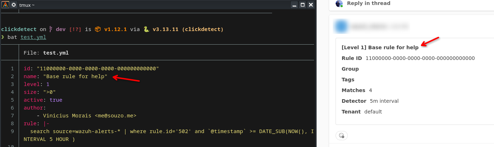
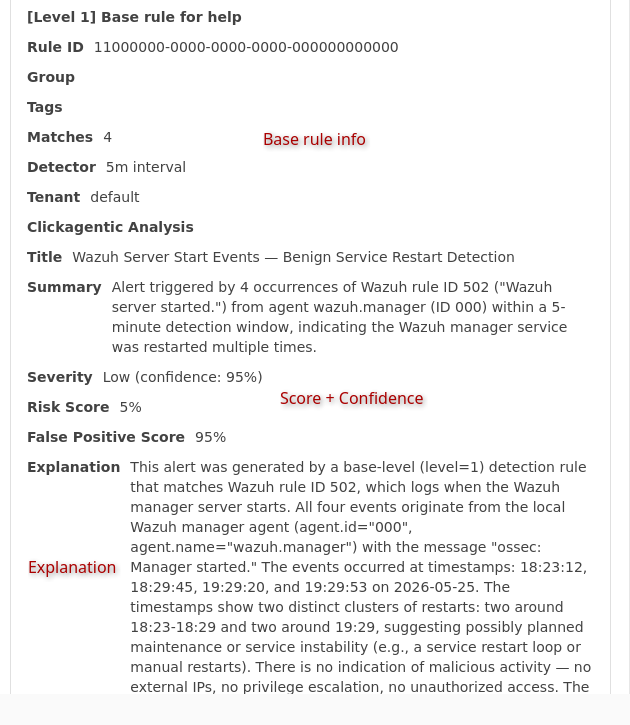

---
authors:
    - souzo
categories:
    - siem
    - clickhouse
    - alerting
    - blog
    - clickdetect
    - security
    - wazuh
tags:
    - clickhouse
    - clickdetect
    - wazuh
date: 2026-05-26
pin: false
---

# Extending Wazuh detection capabilities with clickdetect, Opensearch PPL and Sigma Rules

Hey, souzo here. If you've ever wanted alerting rules that actually work in Wazuh without fighting OpenSearch's detection engine, this post is for you.

> Repository: [https://github.com/clicksiem/clickdetect](https://github.com/clicksiem/clickdetect)

In this blog post I will guide you to:
- Install and configure Opensearch PPL in an existing Wazuh environment
- Install and configure clickdetect
- Write Opensearch PPL
- Write Sigma rules with Opensearch PPL
- Detect threats with your Wazuh data extending wazuh detetion capabilities

# Introduction

After working many years with wazuh and opensearch, I wanted some features that currently not exists or are so broken to work with.

OpenSearch has been working to transform its product into a complete SIEM with a detection engine, however... it's VERY buggy. I tested it several times with real data and always ended up with a corrupted index.

I looked into Elastalert, but I didn't like its engine; I found the code and maintenance too confusing. Also, why create a rules system when I can use the datasource's own language? So instead of forking, I created my own solution.

I created [ClickDetect](https://github.com/clicksiem/clickdetect) to help security teams around the world have an additional tool for generating alerts.

## Clickdetect

Clickdetect is an alerting system tool created to help you to create your detection strategy in whatever datasource you want.

Clickdetect has many datasources supported like:
- Clickhouse (+sigma)
- Opensearch + Opensearch PPL (+sigma)
- Elasticsearch
- Victorialogs
- PostgreSQL
- Loki (+sigma)
- Databricks

Clickdetect is multi-tenant by default, you can specify tenant in rules too.

### Sigma

Clickdetect v1.4.0 actually supports sigma backend. Check out the documentation [https://clickdetect.souzo.me/sigma/](https://clickdetect.souzo.me/sigma/)

## Opensearch & Opensearch PPL

I created ClickDetect to work primarily with ClickHouse because, in my opinion, it's a better alternative, as it allows for magnificent data compression, which directly impacts the price of SOC services. Furthermore, wazuh's data is structured, so the ClickHouse JSON column makes more sense (My opinion).

But in this post I will show that it's possible to use ClickDetect with OpenSearch.

### PPL (Piped Processing Language)

Opensearchppl is used to search, filter, and analyze data in an easy and intuitive way. It's very similar to the LogQL language of Loki or Splunk SPL.

This greatly increases the possibility of turning OpenSearch into a SIEM instead of running queries in the standard DSL format.

#### Why not SQL?

If you want SQL, try clickhouse or postgresql of tigerdata. PPL makes more sense for Opensearch environment.

## Architecture

Here's how all the pieces fit together:


Wazuh ships events into the OpenSearch indexer. Clickdetect queries the indexer using PPL (or compiled Sigma rules), evaluates the configured rules on a schedule, and fires alerts to your webhooks when a condition is met.

# Let's bora

## Installing Opensearch PPL in Wazuh

Following the documentation, we first need to install SQL plugin [https://docs.opensearch.org/latest/sql-and-ppl/ppl/index/](https://docs.opensearch.org/latest/sql-and-ppl/ppl/index/).

Your openseach configurations and binaries are in the directory `/usr/share/wazuh-indexer/`.
Change your directory

```bash
cd /usr/share/wazuh-indexer/
```

First, verify if your opensearch does not have Opensearch SQL Plugin installed. The plugin usually comes pre-installed with Wazuh.

```bash
./bin/opensearch-plugin list
```

If the plugin is not installed, install it.

```bash
bin/opensearch-plugin install opensearch-sql
```

Restart your wazuh indexer

```
systemctl restart wazuh-indexer
```

Now It's fully operational.

## Installing and configuring clickdetect

### Creating rules

```bash
mkdir -p rules/
cat << EOF > rules/manager_started.yml
id: $(cat /proc/sys/kernel/random/uuid)
name: "Wazuh opensearch sigma test - Manager Started"
level: 10
size: ">0"
active: true
author: 
    - Vinicius Morais <me@souzo.me>
group: base_rule
tags: 
    - base
rule: |-
    search source=wazuh-alerts-* | where rule.id='502' and `@timestamp` >= DATE_SUB(NOW(), INTERVAL 5 HOUR )
EOF
```

### Creating runner

You need to configure a runner, runner is a file that configure the schedulers, webhooks and the datasource.

For this example, we will use "teams" as the webhook and configure the detector to run every 5 minute.

```bash
cat << EOF > runner.yml
datasource:
    type: opensearch-ppl
    url: https://127.0.0.1:9200
    username: wazuh
    password: wazuh-adm
    verify: false

webhooks:
    teams_alert:
        type: teams
        url: https://<your_companie>.webhook.office.com/...
        timeout: 10
        verify: false

detectors:
    my_detector:
        name: "5m interval"
        for: "5m"
        description: "detect rules with 5 min interval"
        rules:
            - "/app/rules/*"
        webhooks:
            - teams_alert
```

### Running

Now you can run with docker.

```bash
docker run -v ./runner.yml:/app/runner.yml -v ./rules/:/app/rules/ ghcr.io/clicksiem/clickdetect:latest
```

### Results

*Running*



Clickdetect starts up, loads the rule from `rules/`, and schedules the detector to run every 5 minutes.

*Results in terminal*



The terminal output shows the rule matched at least one event. Each match includes the rule name, level, and the raw document returned by the PPL query.

*Results in teams*



The Teams webhook delivers the alert card with the rule name, severity level, and a summary of the matched events.

# Going further

This is an extra to you understand the potential.

## Sigma rules

You can use sigma rules with clickdetect, check out the documentation. [https://clickdetect.souzo.me/sigma/](https://clickdetect.souzo.me/sigma/)

### Configure rule

> *WARNING*: opensearch PPL sigma backend I'ts aligned with the latest opensearch version, "*earliest*" and "*latest*" I'ts not recorinized in wazuh indexer 2.19

Let's create the sigma rule directory and save the sigma rule.

```bash
mkdir -p rules/sigma/
```

Save your rule inside the created directory.

```yml
cat << EOF > rules/sigma/manager_started.yml
title: "wazuh opensearch sigma test - Manager Started"
status: test
id: 32bc608c-67ab-4d58-8361-35d3baac726c
logsource:
    product: wazuh
    category: indexer
detection:
    sel:
        rule.id: '502'
    condition: 1 of sel
custom:
    opensearch_ppl_min_time: "-5m"
    opensearch_ppl_max_time: "now"
EOF
```

### Configure runner

Change the directory of rule in you runner

```bash
cat << EOF > runner.yml
datasource:
    type: opensearch-ppl
    url: https://127.0.0.1:9200
    username: wazuh
    password: wazuh-adm
    verify: false

webhooks:
    teams_alert:
        type: teams
        url: https://<your_companie>.webhook.office.com/...
        timeout: 10
        verify: false

detectors:
    my_sigma_detector:
        name: "5m interval"
        for: "5m"
        description: "detect sigma rule with 5 min interval"
        rules:
            - "/app/rules/sigma/*"
        sigma: true
        webhooks:
            - teams_alert
```

### Run

Now you can run.

```bash
docker run -v ./runner.yml:/app/runner.yml -v ./rules/:/app/rules/ ghcr.io/clicksiem/clickdetect:latest
```

## AI

Clickdetect + AI SOC Agent. You can specify an AI to auto analyze and generate score using clickdetect agentic plugin.

*Example with deepseek*.

```bash
plugins: 
    clickagentic:
        provider: 'deepseek'
        model: 'deepseek-chat'
        token: '<token>'
```

### Results

This is the result of clickagentic with teams webhook.



Check out the documentation: [https://clickdetect.souzo.me/plugin/clickagentic/](https://clickdetect.souzo.me/plugin/clickagentic/)

# Conclusion

With this blog post now you can:
- Run Sigma rules inside your wazuh environment
- Perform multi tenant search and cross site search
- Perform correlation between different logs sources
- Improve your SOC team.

Clickdetect is not affiliated to ClickHouse, and I'm not sponsored (yet).

If this post helped you, consider giving [clickdetect a star on GitHub](https://github.com/clicksiem/clickdetect) — it helps the project reach more security teams. :star:

Follow my social:
* *E-mail*: me@souzo.me
* *Matrix*: @souzo:matrix.org
- *Twitter/X*: [https://x.com/souzomain](https://x.com/souzomain)
- *Linkedin*: [https://www.linkedin.com/in/vinicius-m-a76ba51b5/](https://www.linkedin.com/in/vinicius-m-a76ba51b5/)
- *Reddit*: [https://www.reddit.com/user/_souzo/](https://www.reddit.com/user/_souzo/)
