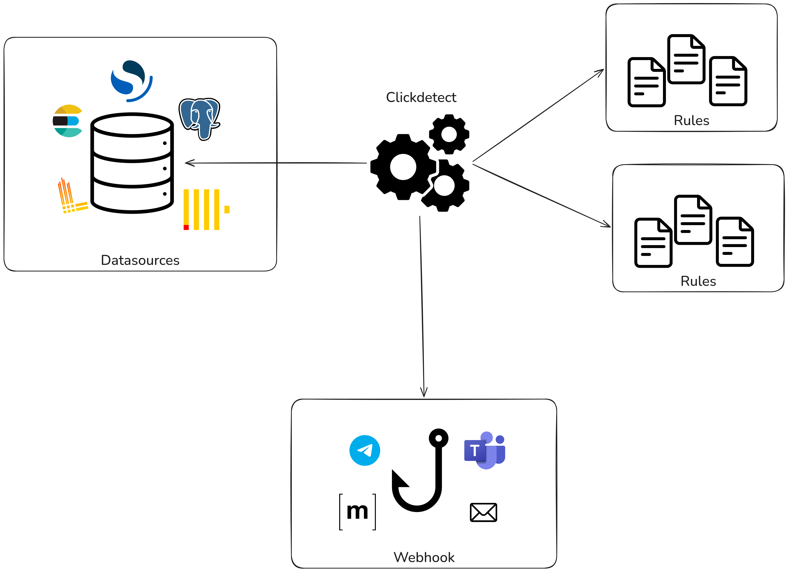

# Introduction

**Clickdetect** is a framework for threshold-based detection and alerting. It periodically queries your data sources, evaluates rules against the results, and sends alerts to one or more destinations when conditions are met.

You can pull events from any DataSource implemented, and push alerts to any webhook.

# Overview

Diagram



```sh
runner.yml
    │
    ├── datasource  ──► ClickHouse / Elasticsearch / Loki / ...
    │
    ├── webhooks    ──► Generic HTTP / Teams / Email / Matrix / ...
    │
    └── detectors
            │
            ├── interval (e.g. "5m")
            ├── rules (YAML files or glob patterns)
            │       └── SQL / DSL / LogQL query + condition (e.g. ">0")
            └── webhooks to notify when condition is met
```

## How it works

1. Each **detector** runs on a configurable interval (e.g. every 5 minutes).
2. On each tick, it evaluates its **rules** — each rule renders a query with Jinja2, executes it against the datasource, and checks whether the row count satisfies the rule's `size` condition (e.g. `>0`, `>=10`, `==5`).
3. If the condition is met, all linked **webhooks** are called with the alert payload.

## Key concepts

| Concept | Description |
|---|---|
| **Datasource** | Where events are queried from (ClickHouse, Elasticsearch, Loki, ...) |
| **Rule** | A query + a condition that defines what constitutes an alert |
| **Detector** | Groups rules together, runs them on a schedule, and triggers webhooks |
| **Webhook** | Where alerts are sent (HTTP, Teams, Email, Matrix, ...) |
| **Tenant** | An identifier for multi-tenancy, passed to rule templates |
